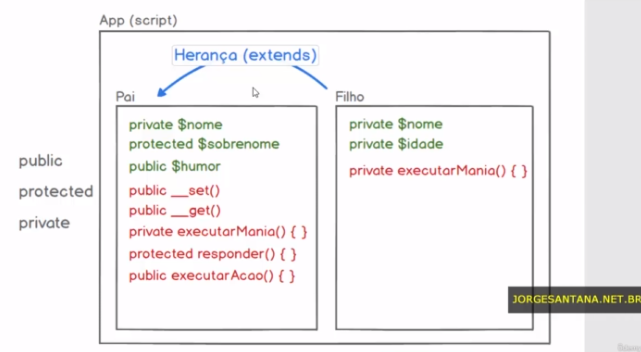
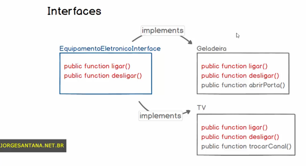
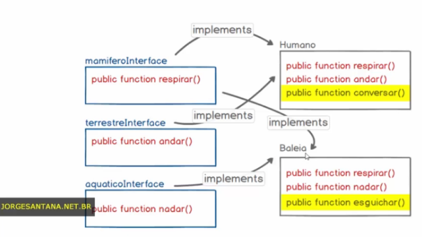
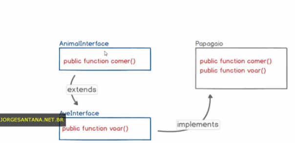
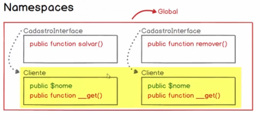
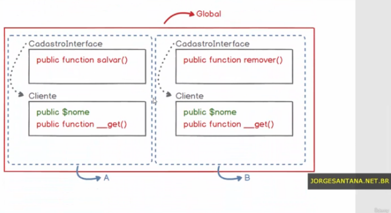
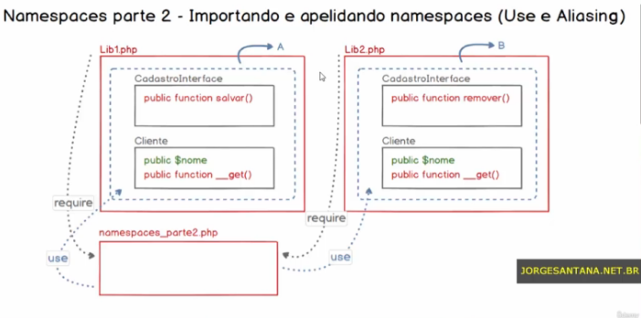
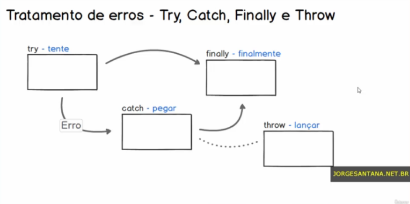

<h2>Estudando PHP 🐘</h2>
<h3>Seção 12: PHP e Orientação a Objetos</h3>

Curso Desenvolvimento Web Completo 2022

<a target="_blank" href="https://github.com/monicaquintal/estudandoPHP">Introdução ao PHP.</a>

## Conteúdo

<a href="#aula01">Aula 01: Introdução à Orientação a Objetos - Considerações preliminares.</a> 
<a href="#aula02">Aula 02: Introdução à Orientação a Objetos.</a> 
<a href="#aula03">Aula 03: OO - Pilar da Abstração.</a> 
<a href="#aula04">Aula 04: Getters e Setters.</a> 
<a href="#aula05">Aula 05: Getters e Setters mágicos (overloading de atributos e métodos).</a> 
<a href="#aula06">Aula 06: Chamando métodos internamente.</a> 
<a href="#aula07">Aula 07: Método Construtor e Destrutor (Construct e Destruct).</a> 
<a href="#aula08">Aula 08: OO - Pilar da Herança.</a> 
<a href="#aula09">Aula 09: OO - Pilar do Polimorfismo.</a> 
<a href="#aula10">Aula 10: OO - Pilar do Encapsulamento parte 1.</a> 
<a href="#aula11">Aula 11: OO - Pilar do Encapsulamento parte 2.</a> 
<a href="#aula12">Aula 12: Atributos e métodos estáticos.</a> 
<a href="#aula13">Aula 13: Interfaces.</a> 
<a href="#aula14">Aula 14: Namespaces parte 1 - Utilizando namespaces para Classes e Interfaces.</a> 
<a href="#aula15">Aula 15: Namespaces parte 2 - Importando e apelidando namespaces.</a> 
<a href="#aula16">Aula 16: Tratamento de erros - Try, Catch, Finally e Throw.</a> 
<a href="#aula17">Aula 17: Tratamento de erros - Exceções customizadas.</a> 

<h2>Aula 01: Introdução à Orientação a Objetos - Considerações preliminares.</h2>

É um dos **Paradigmas de Programação**, suportado pelo PHP. 

Paradigma é um padrão, conduta, modelo, forma de se fazer alguma coisa. As linguagens podem ou não suportar o paradigma desejado. Os dois mais difundidos são:

- Procedural / Estruturado / Imperativo - princípios:
  - sequência (interpretação gravitacional e chamada de funções);
  - decisão (aplicação de comandos como if/else e switch) 
  - e repetição (aplicação de comandos como for, while e do while).

- Orientado a Objetos
  - considerado sucessor do procedural, mas na verdade, se completam.
  - seus princípios serão abordados neste módulo!
  

<h2>Aula 02: Introdução à Orientação a Objetos.</h2>

Paradigmas:

1. Procedural:

Fax a chamada de procedimentos (procedures - métodos, rotinas, funções...) para manipulação de dados.

A interpretação do script é uma questão sequencial, gravitacional (de cima para baixo).

~~~php
$a = 10;
$b = 7; 
$operador = 'soma';

function calcular ($a, $b, $operador) {
  if ($operador == 'soma') {
    return $a + $b;
  }
  return false;
}
echo calcular($a, $b, $operador);
~~~

2. Orientação a Objetos:

Estrutura de dados com seus respectivos comportamentos.

~~~php
class Calculadora {
  public $a = 10;
  public $b = 7; 
  public $operador = 'soma';
}

public function calcular () {
  if($this->operador == 'soma') {
    return $this->a + $this->b;
  }
  return false; 
}

$calcular = new Calculadora();
echo $calcular->calcular();
~~~

Há uma mudança na forma de pensamento e programação!

Abstração = forma como se interpreta o que ocorre no mundo real.

Os pilates da OO são:
1. Abstração;
2. Encapsulamento;
3. Herança;
4. Polimisfismo.

<h2>Aula 03: OO - Pilar da Abstração. </h2>

### Abstração:
Consiste na forma como nós interpretamos as coisas do mundo real e transportamos para nossas aplicações.

### Conceitos:

1. Entidade: é a compreensão de que um objeto do mundo real deve passar para dentro da aplicação.

2. Identidade: é no processo de criação ou instância do projeto, com base nos modelos, que podemos criar uma associação de identidade (trata-se de uma referência que irá, futuramente, nos permitir acessar o objeto em questão).

3. Características: atributos.

4. Ações: métodos (são, na essência, funções) ou comportamentos.

Entidade | Identidade | Catacterísticas | Ações
---------|------------|------------------|----------
Produto | x = new Produto() | categoria, título, descrição, valor | exibirResumoProduto, alterarValorProduto
Ideia | z = new Ideia() | tipo, descrição, complexidade | modificarTipoIdeia
Funcionario | y = new Funcionario() | nome, telefone, numFilhos | resumirCadFunc, modificarNumFilhos

Ou seja, ao invés de apenas enviar dados para funções, criaremos objetos (dados), dentro do qual vamos inserir comportamentos!

### Praticando:

> arquivo `oo_pilar_abstracao.php`

Exemplo de relatório que apresente os funcionários da empresa.

- Entidade: Funcionario
- Identidade: y = new Funcionario()
- Características: nome, telefone, numFilhos
- Ações: resumirCadFunc, modificarNumFilhos

**Utilizar o padrão CamelCase para definir a entidade!** E, nos atributos/variáveis/funções, utilizar a partir da 2a palavra!

**Modelo:**

~~~php
class Funcionario {

  //atributos
  public $nome = null;
  public $telefone = null;
  public $numFilhos = null;

  //métodos
  function resumirCadFunc() {
    return 'Esse é o resumo do cadastro do funcionário:';
  }

  function modificarNumFilhos() {
    // afetar um atributo do objeto
  }

}
~~~

**Instanciando objetos:**

~~~php
// criando um objeto com base no modelo Funcionário, 
// e atribuindo esse objeto à variável (dando acesso aos atributos/métodos).
$y = new Funcionario();
// chamando o atributo ou método desejado
echo $y->resumirCadFunc();
echo ' ';
$y->modificarNumFilhos(3);
echo $y->resumirCadFunc();
echo '
';

//criando variável x 
//e atribuindo a ela uma nova instância de Funcionário (novo objeto)
$x = new Funcionario();
echo $x->resumirCadFunc();
echo ' ';
$x->modificarNumFilhos(1);
echo $x->resumirCadFunc();
~~~

O operador `$this` é um operador de ajuste de contexto. Ele indica ao interpretador do PHP que estamos falando do atributo do objeto em questão.

<h2>Aula 04: Getters e Setters. </h2>

> arquivo `oo_pilar_abstracao.php`

São métodos utilizados para manipulação de atributos, que permitem atender uma convenção/boas práticas (que indica qual a melhor forma de **acessar e manipular os atributos dos objetos**).

O ideal é que as classes sejam genéricas, com atributos que não sejam engessados.

### 1. Métodos Setters:

Sua finalidade é settar ou definir os valores dos atributos dos objetos. Esse método receberá um parâmetro, o recuperará e atribuirá esse valor ao atributo do objeto. 

São métodos do tipo void, que apenas recebem determinado valor e manipulam, sem gerar retorno.

**Importante:** Sempre iniciar com a palavra `set` (boa prática).

Exemplo:

~~~php
function setNome($nome) {
  $this->nome = $nome;
}

function setNumFilhos($numFilhos) {
  $this->numFilhos = $numFilhos;
}
~~~

### 2. Métodos Getters:

Permitem recuperar os valores dos atributos. São métodos do tipo return, que retornarão o atributo solicitado.

**Importante:** Sempre iniciar com a palavra `get` (boa prática).

~~~php
function getNome() {
  return $this->nome;
}

function getNumFilhos() {
  return $this->numFilhos;
}
~~~

### 3. Instanciando objetos:

~~~php
$y = new Funcionario();
$y->setNome("Mônica");
$y->setNumFilhos(1);
echo $y->resumirCadFunc(); // OU:
echo $y->getNome() . ' possui ' . $y->numFilhos . ' filho(s).';

$x = new Funcionario();
$x->setNome("João");
$x->setNumFilhos(3);
echo $x->getNome() . ' possui ' . $x->numFilhos . ' filho(s).';
~~~

<h2>Aula 05: Getters e Setters mágicos (overloading de atributos e métodos). </h2>

> arquivo `oo_pilar_abstracao.php`

Atualmente, questiona-se de utilizar métodos getters e setters consiste em uma boa prática, pois torna o código extenso e redundante - cria um conflito entre um pilar e a prática!

Há algumas formas de atender ao que é considerado boa prática (utilizando getters e setters), porém de uma forma mais inteligente, através da criação de métodos mágicos, utilizando o conceito de `overloading` ou sobrecarga: criar **um único método set e um único método get, capaz de se adaptar ao atributo que queremos manipular**.

Por convenção, adotar:

~~~php
function __set() { //dois underlines
  <...>
}
~~~

Na prática:

~~~php
class Funcionario {

//atributos
public $nome = null;
public $telefone = null;
public $numFilhos = null;
public $cargo = null;
public $salario = null;

//getters setters (overloading / sobrecarregar)
function __set($atributo, $valor) {
  $this->$atributo = $valor;
}

function __get($atributo) {
  return $this->$atributo;
}

function resumirCadFunc() {
  return "$this->nome possui $this->numFilhos filho(s)!";
}

function modificarNumFilhos($numFilhos) {
  $this->numFilhos = $numFilhos;
}
}

$y = new Funcionario();
$y->__set('nome', 'José');
$y->__set('numFilhos', 2);
echo $y->__get('nome') . ' possui ' . $y->__get('numFilhos') . ' filho(s) ';
echo ' ';
$x = new Funcionario();
$x->__set('nome', 'Maria');
$x->__set('numFilhos', 0);
echo $x->__get('nome') . ' possui ' . $x->__get('numFilhos') . ' filho(s) ';
~~~

<h2>Aula 06: Chamando métodos internamente.</h2>

> arquivo `oo_pilar_abstracao.php`

Chamar métodos dentro de outros métodos é uma implementação muito comum!

Exemplo:

~~~php
function resumirCadFunc() {
  return $this->__get('nome') . " possui " . $this->__get('numFilhos') . " filho(s)!";
}
~~~

<h2>Aula 07: Método Construtor e Destrutor (Construct e Destruct). </h2>

São conhecidos como **métodos mágicos** `__construct()` e `__destruct()`!

Fazem parte do "ciclo de vida" de um objeto: quando criamos a instância de um objeto com base em uma classe, automaticamente o método construtor é executado, de modo que uma ação possa ser tomada no processo de inicialização do objeto. Já o método destrutor, é executado automaticamente quando a instância do objeto é removida da m,memória (quando o objeto deixa de existir).

> arquivo `construtor_destrutor.php`

Exemplo:

~~~php
class Pessoa {

  public $nome = null;

  function __construct($nome) {
    echo "Objeto iniciado!" . " ";;
    $this->nome = $nome;
  }

  function __destruct(){
    echo "Objeto removido!";
  }

  function __get($atributo) {
    return $this->$atributo;
  }

  function correr() {
    return $this->__get('nome') . " está correndo!";
  }
}

$pessoa = new Pessoa('Mônica'); // instanciando o objeto
echo 'Nome: ' . $pessoa->__get('nome') . ' ';
echo $pessoa->correr();

echo ' ';
//unset($pessoa); // proposital
~~~

<h2>Aula 08: OO - Pilar da Herança.</h2>

Segundo príncipio que sustenta o paradigma da Orientação a Objetos.

A Herança traz dois benefícios ao código:
1. Reutilizável
2. Manutenção

> arquivo `oo_pilar_heranca.php`

Exercício de abstração:

~~~php
// CARRO:
$placa
$cor
$teto_solar

$acelerar() {}
$abrirTetoSolar() {}
$alterarPosicaoVolante() {}

// MOTO:
$placa
$cor
$contra_peso_guidao

$acelerar() {}
$empinar() {}
~~~

Em php, inicialmente, temos:

~~~php
class Carro {
  public $placa = 'ABC1234';
  public $cor = 'branco';
  public $teto_solar = true;

  function acelerar() {
    echo 'Acelerar';
  }

  function abrirTetoSolar() {
    echo 'Abrir teto solar';
  }

  function alterarPosicaoVolante() {
    echo 'Alterar posição do volante';
  }
}

class Moto {
  public $placa = 'DEF1122';
  public $cor = 'preta';
  public $contra_peso_guidao = true;

  function acelerar() {
    echo 'Acelerar';
  }

  function empinar() {
    echo 'Empinar';
  }
}

$carro = new Carro();
$moto = new Moto();

echo '<pre>';
print_r($carro);
print_r($moto);
echo '</pre>';
~~~

E, exibindo os dados no browser:

~~~
Carro Object
(
    [placa] => ABC1234
    [cor] => branco
    [teto_solar] => 1
)
Moto Object
(
    [placa] => DEF1122
    [cor] => preta
    [contra_peso_guidao] => 1
)
~~~

A **herança** também é um exercício de abstração: a ideia é compreender o que existe em comum entra os objetos da nossa aplicação, que possa sr abstraído e definido em outro modelo. Ou seja, **centralizar atributos e métodos comuns aos objetos, de modo a implementar outras classes (especialistas)**.

Podemos observar que, no exemplo, os atributos `$placa` e `$cor` são comuns aos objetos carro e moto, assim como o método `$acelerar() {}`!

Podemos, então, centralizar essas características e ações dentro de um terceiro modelo! (podemos utilizar também os termos `Classe Pai/Filhos` e `Classes Genérica/Especializadas` ou `Superclasse/Subclasses`).

Precisamos explicitar a relação de Herança no código! Para isso, utilizar: 

~~~
class Filho extends Pai () {
  <...>
}
~~~

E, no exemplo da aula, teremos:

~~~php
class Carro extends Veiculo {
  public $teto_solar = true;

  function __construct($placa, $cor) {
    $this->placa = $placa;
    $this->cor = $cor;
  }

  function abrirTetoSolar() {
    echo 'Abrir teto solar';
  }

  function alterarPosicaoVolante() {
    echo 'Alterar posição do volante';
  }
}

class Moto extends Veiculo {
  public $contra_peso_guidao = true;

  function __construct($placa, $cor) {
    $this->placa = $placa;
    $this->cor = $cor;
  }

  function empinar() {
    echo 'Empinar';
  }
}

class Veiculo {
  public $placa = null;
  public $cor = null;

  function acelerar() {
    echo 'Acelerar';
  }
}

$carro = new Carro('ABC1234', 'branco');
$moto = new Moto('DEF1122', 'preta');

echo '<pre>';
print_r($carro);
print_r($moto);
echo '</pre>';
echo '
';

echo $carro->abrirTetoSolar();
echo ' ';
echo $carro->acelerar();
echo '
';

echo $moto->empinar();
echo ' ';
echo $moto->acelerar();
~~~

Explorando a vantagem de **manutenção do código**:

Caso precisemos, por exemplo, criar o método `frear(){}`, comum ao carro e à moto, poderemos simplesmente defini-lo na Classe Veiculo, e passar a utiliza-lo nos objetos especializados Carro e Moto!

~~~php
class Veiculo {
  public $placa = null;
  public $cor = null;

  function acelerar() {
    echo 'Acelerar';
  }

  function frear() {
    echo "Frear";
  }
}

<...>

echo $carro->frear();
echo '
';
echo $moto->frear();
~~~

<h2>Aula 09: OO - Pilar do Polimorfismo.</h2>

Polimorfismo consiste na sobrescrita de métodos.

> arquivo `oo_pilar_polimorfismo.php`

Continuaremos trabalhando com o exemplo da aula anterior (oo_pilar_heranca.php), porém no novo arquivo oo_pilar_polimorfismo.php).

~~~php
// VEICULO
$plaa
$cor

$acelerar() {}
$frear() {}
$trocarMarcha() {}
// Herança

// CARRO
$teto_solar

$abrirTetoSolar() {}
$alterarPosicaoVolante() {}

// MOTO
$contra_peso_guidao

$empinar() {}
$trocarMarcha() {}
~~~

A Classe Veículo, da aula anterior, passará a possuir o novo método `$trocarMarcha() {}`, comportamento comum tanto para carro quanto para moto. Entretanto, o objeto Moto possui uma particularidade na forma como troca a marcha (usamos a mão para desengatar embreagem e pé para engatar a marcha).

Aplicando no código:

~~~php
<...>
class Veiculo {
<...>
  function trocarMarcha() {
    echo "Desengatar embreagem com o pé e engatar marcha com a mão";
  }
}

$carro = new Carro('ABC1234', 'branco');
$moto = new Moto('DEF1122', 'preta');

$carro->trocarMarcha();
echo ' ';
$moto->trocarMarcha();

/* Dessa forma, imprime resultados iguais para carro e moto;
 como proceder para indicar a particularidade 
 do método trocarMarcha(){} na Classe Moto? */
~~~

Temos duas possibilidades:

1. implementar um método específico para o Filho dentro da Classe Pai (inadequado, fere o princípio do Polimorfismo, causando redundância de código, já que todos os filhos o herdariam).

2. definir NO OBJETO FILHO como esse método deve se comportar!

Para sobrescrever o método, é simples: basta definir no objeto filho como esse método deve se comportar para este objeto!

~~~php
class Moto extends Veiculo {
<...>
  function trocarMarcha() {
    echo "Desengatar embreagem com a mão e engatar marcha com o pé";
  }
}
<...>
~~~

<h2>Aula 10: OO - Pilar do Encapsulamento parte 1.</h2>

Do **ponto de vista conceitual**, consiste em encapsular um objeto, tornando-o seguro. Significa que o objeto terá condições de dizer o que dentro dele está disponível para o sistema.

É uma forma de controlar a visibilidade dos atributos e métodos de acordo com as necessidades.

**Na prática**, podemos definir se um determinado atributo/método é privado ou público, ou se esse atributo/método deve ou não ser herdado pelos seus filhos, criando uma camada de segurança para cada um dos objetos da nossa aplicação!!!

Exemplo:

Neste caso, temos atributos e métodos configurados com visibilidades diferentes. Portanto, quando abordamos esse conceito de Encapsulamento, é importante ter em mente os operadores de visibilidade: public, protected e private.

> arquivo `oo_pilar_encapsulamento.php`

`Atributos públicos` estão disponíveis para serem acessados diretamente pela instância do objeto; ou seja, tanto para aplicação quanto para outros objetos. Ou seja, está disponível para o mundo!

~~~php
class Pai {
  public $humor = "com sono";
}

$pai = new Pai();

echo $pai->humor;
$pai->humor = 'feliz';
echo ' ';
echo $pai->humor;
~~~

Porém, caso tentemos realizar a mesma ação (acessando diretamete) em atributos private ou protected, teremos um erro (indica que o acesso a propriedades privadas/protegidas está bloqueado - É UM NÍVEL DE SEGURANÇA!) Ou seja, estarão disponíveis apenas para o próprio objeto.

~~~php
$pai = new Pai();
echo $pai->nome;
// Fatal error: Uncaught Error: Cannot access private property Pai::$nome (...)

echo $pai->sobrenome;
// Fatal error: Uncaught Error: Cannot access protected property Pai::$sobrenome
~~~

Do ponto de vista da interação Objeto-Aplicação, os operadores protected e private serão idênticos, não estando disponíveis para a aplicação. ***Porém, eles se comportam de forma diferente no processo de herança!***

### Por que criar atributos protegidos?

Geralmente, atributos privados ou protegidos são criados para que sua modificação dependa de alguma regra de negócio (Interface!), a qual deve ser respeitada sempre que esses atributos ou métodos forem acessados.

Logo, o mais coerente é disponibilizar o acesso desses atributos somente a partir de uma interface que implemente
essas regras de negócio.

~~~php
class Pai {
  private $nome = "Mônica";

  public function getNome() {
    return $this->nome;
  }

  public function setNome($value) {
    $this->nome = $value;
  }
}

$pai = new Pai();

echo $pai->getNome();
echo ' ';
$pai->setNome("João");
echo $pai->getNome();
~~~

Portanto, através dos `métodos de interface`, poderemos manipular atributos privados ou protegidos (podendo estabelecer uma regra de negócio)!

O exemplo abaixo trata-se de "regra de negócio". É um nível de segurança, onde o valor do atributo só será modificado a partir de um método público de interface de objeto, que atenda a uma determinada regra de negócio!

~~~php
// método de interface
  public function setNome($value) { 
    if(strlen($value) >= 3) {
      $this->nome = $value;
    }
  }

echo $pai->getNome(); // retorna "Mônica"
echo ' ';
$pai->setNome("João");
echo $pai->getNome(); // retorna "João"
echo ' ';
$pai->setNome("Oi");
echo $pai->getNome(); // retorna "João" novamente
// (pois não atende à regra)
~~~

O mesmo efeito ocorrerá para o atributo "protected", no que se refere à visibilidade (interação script-objeto.)

### Métodos mágicos __set() e __get():

Estão preparados para trabalhar com atributos privados e protegidos. Ao serem definidos, ganhamos a possibilidade de acessar diretamente estes atributos, a partir da instância do objeto (podendo inclusive atribuir valores diretamente a esses atributos ptivados/protegidos).

Exemplo:

~~~php
class Pai {
  private $nome = "Mônica";
  protected $sobrenome = "Quintal";
  public $humor = "com sono";

  public function __get($atributo) {
    return $this->$atributo;
  }

  public function __set($atributo, $valor) {
    $this->$atributo = $valor;
  }
}

$pai = new Pai();
echo $pai->humor;
echo " ";
echo $pai->nome;
echo " ";
echo $pai->sobrenome;
echo " ";
echo $pai->sobrenome = "Oliveira";
~~~

### Implementando métodos:

Os operadores de visibilidade aplicados aos métodos funcionam de forma análoga ao que vimos em relação aos atributos:

- atributos e métodos públicos: disponíveis para aplicação e para outros objetos.

- métodos privados ou protegidos: disponíveis apenas para o próprio projeto, quando estamos falando da relação entre a aplicação e o objeto.

~~~php
private function executarMania() {
  echo "Assoviar";
}

protected function responder() {
  echo "Oi!";
}

echo $pai->executarMania();
// Fatal error: Uncaught Error: Call to private method Pai::executarMania() from global scope
echo $pai->responder();
// Fatal error: Uncaught Error: Call to protected method Pai::responder() from global scope
~~~

Para acessar esses métodos protegidos ou privados, precisaremos de um método público, que faça a interface entre a aplicação e o objeto!

Exemplo:

~~~php
  private function executarMania() {
    echo "Assoviar";
  }

  public function executarAcao() {
    $this->executarMania();
    echo ' ';
    $this->responder();
  }

$pai = new Pai();
echo $pai->executarAcao();
// "Assoviar"
// Oi!
~~~

<h2>Aula 11: OO - Pilar do Encapsulamento parte 2.</h2>

> arquivo `oo_pilar_encapsulamento.php`
(dando continuidade ao conteúdo e arquivo da aula anterior)

### Como o princípio de Encapsulamento se comporta no contexto de Herança?

### A) Atributos:

 A Classe Filho automaticamente herda ***todos*** os atributos e métodos da classe Pai cujos operadores de visibilidade estejam settados como ***public e protected***.

Ou seja, ***no processo de herança, `atributos e métodos private não são herdados`***.

~~~php
class Filho extends Pai {
  public function getAtributo($atributo) {
    return $this->$atributo;
  }
}

$filho = new Filho();
echo $filho->getAtributo('humor');
// recupera "com sono"
echo ' ';
echo $filho->getAtributo('sobrenome');
//retorna "Quintal"
echo ' ';
echo $filho->getAtributo('nome');
// Warning: Undefined property: Filho::$nome
// erro; é um atributo específico da Classe Pai (private)!
// não faz parte do contexto do objeto filho!
~~~

Testando a modificação do estado do objeto:

~~~php
class Filho extends Pai {
  public function getAtributo($atributo) {
    return $this->$atributo;
  }

  public function setAtributo($atributo, $valor) {
    $this->$atributo = $valor;
  }
}

$filho->setAtributo('humor', 'feliz');
echo $filho->getAtributo('humor');
// recupera "feliz"
echo ' ';
$filho->setAtributo('sobrenome', 'Oliveira');
echo $filho->getAtributo('sobrenome');
// recupera "Oliveira"
echo ' ';
$filho->setAtributo('nome', 'João');
echo $filho->getAtributo('nome');
echo ' ';
// recupera "João"
~~~

Conforme indicado acima, podemos criar atributos dinâmicos no contexto do objeto, mesmo quando se trata de um operador de visibilidade privada (atributo específico da Classe Pai); ou seja, apesar do nome ser `private`, podemos alterar e recuperar o seu valor dinamicamente. Portanto, quando utilizamos o mpetodo público e alteramos o seu valor, cria-se um **novo atributo (que será público), com novo valor** (não equivale ao atributo original, que é *específico* da Classe Pai)!!!

### B) Métodos mágicos __set() e __get():

A função nativa `get_class_methods()` espera receber por parâmetro um objeto, e retorna um array com a relação de métodos internos deste objeto!

~~~php
// exibir os métodos do objeto
echo '<pre>';
print_r(get_class_methods($filho));
echo '</pre>';

/*
Array
(
    [0] => __get
    [1] => __set
    [2] => executarAcao
)
*/
~~~

O método mágico definido tem a inteligência de acessar o atributo do objeto Pai, já que get e set foram inicialmente definidos no mesmo contexto, que é o objeto pai!!!

~~~php
class Pai {
  private $nome = "Mônica";
  protected $sobrenome = "Quintal";
  public $humor = "com sono";

  public function __get($atributo) {
    return $this->$atributo;
  }

  public function __set($atributo, $valor) {
    $this->$atributo = $valor;
  }
}

$filho = new Filho();

echo $filho->__get('nome');
// recupera "Mônica"
echo ' ';
echo $filho->__set('nome', 'João');
echo $filho->__get('nome');
// recupera "João"

~~~

Porém, se os métodos get e set forem definidos no objeto filho, irão trabalhar apenas no contexto do objeto filho (não consegue rastrear atributo privado da Classe Pai, por exemplo)!

Ou seja, o contexto dos métodos mágicos influencia em relação a encontrar ou não atributos de objetos Pais.

~~~php
class Filho extends Pai {

  public function __get($atributo) {
    return $this->$atributo;
  }

  public function __set($atributo, $valor) {
    $this->$atributo = $valor;
  }
}

$filho = new Filho();

echo $filho->__get('nome');
echo ' ';
// Warning: Undefined property: Filho::$nome
echo $filho->__set('nome', 'João');
echo $filho->__get('nome');
// recupera "João" 
// (novo atributo público criado!)
~~~ 

### C) Métodos:

Segue a lógica anterior; `public e protected` são herdados, enquanto `private` não são (são restritos ao objetos).

Se utilizarmos o método `get_class_methods` na instância do objeto, não conseguiremos acessa os métodos protegidos. Portanto, podemos solicitar que o próprio objeto exponha seus métodos para aplicação (centro da Classe Filho), exibindo métodos protegidos e privados. Portanto, para debug, podemos utilizar o método `__construct()`, da seguinta forma:

~~~php
class Filho extends Pai {

  public function __construct() {
    echo '<pre>';
    print_r(get_class_methods($this));
    echo '</pre>';
  }
}

/* RETORNO:
Array
(
    [0] => __construct
    [1] => responder - private
    [2] => executarAcao - e executarMania() acessada através da lógica
)
Filho Object
(
    [nome:Pai:private] => Mônica
    [sobrenome:protected] => Quintal
    [humor] => com sono
)
~~~

Assim como atributos, métodos protected podem ser sobrepostos dentro do objeto filho, e automaticamente ter o seu contexto atualizado!

<h2>Aula 12: Atributos e métodos estáticos.</h2>

Atributos e métodos estáticos podem ser acessados sem que seja realizada a instância de um objeto com base em uma classe.

> arquivo `atributos_e_metodos_estaticos.php`

Atributos e métodos estáticos precisam receber a palavra reservada `static`, inserida após o operador de visibilidade.

~~~php
class Exemplo {
  public static $atributo1 = 'Eu sou um atributo estático!';
  public $atributo2 = 'Eu sou um atributo normal!';
  
  public static function metodo1 () {
    echo 'Eu sou um método estático.';
  }

  public function metodo2 () {
    echo 'Eu sou um método normal.';
  }
}
~~~

Nos exercícios anteriores, após uma classe ser definida,  utilizamos a instrução abaixo para instanciar o objeto com base no modelo, associando-o a uma variável: 

~~~php
$x = new Exemplo;
~~~

E, a partir da instância do objeto, passamos a ter acesso aos seus respectivos atributos e métodos!

Porém, ***quando estamos trabalhando com atributos e métodos estáticos, não existe a necessidade de fazer a instância do objeto para utilização desses atributos e métodos estáticos da classe***.

A partir do nome da classe, utilizando o operador `::`, podemos acessar diretamente atributos/métodos estáticos! Exemplo:

~~~php
echo Exemplo::$atributo1;
// retorno: Eu sou um atributo estático!
Exemplo::metodo1();
// retorno: Eu sou um método estático.
~~~

No caso de atributos e métodos **não estáticos**:

~~~php
echo Exemplo::$atributo2;
// Fatal error: Uncaught Error: Access to undeclared static property Exemplo::$atributo2

Exemplo::metodo2();
// Fatal error: Uncaught Error: Non-static method Exemplo::metodo2() cannot be called statically
~~~

Ou seja, a `sintaxe/operador de resolução de escopo` ("::") deve ser utilizada APENAS para acesso a atributos e métodos estáticos!

### Observações importantes:

1. Atributos estáticos podem ser instanciados, mas não podem ser acessados pelo operador "->". Exemplo:

~~~php
$x = new Exemplo();
echo $x->atributo1;
// retorno:
// Notice: Accessing static property Exemplo::$atributo1 as non static
// Warning: Undefined property: Exemplo::$atributo1
echo $x->atributo2;
//retorno: Eu sou um atributo normal!
~~~

2. Em relação aos métodos estáticos, não podemos utilizar o operados $this (que ajusta o contexto das variáveis internas dos métodos)! Isso ocorre pois podemos chamar métodos estáticos sem que um objeto seja instanciado.

~~~php
public static function metodo1 () {
  echo $this->atributo2;
  echo 'Eu sou um método estático.';
}

// retorno
// Fatal error: Uncaught Error: Using $this when not in object context
~~~

<h2>Aula 13: Interfaces.</h2>

Interfaces definem os ***métodos*** cujas classes obrigatoriamente precisam implementar (`NÃO SE APLICA A ATRIBUTOS!`); funcionam como uma espécie de "contrato", fazendo com que as classes que implementem essas respectivas interfaces respeitem os métodos estabelecidos nesses contratos, de modo a fazer com que a nossa aplicação tenha certa homogeneidade.

> arquivo `interfaces.php`

### Modelo estudado nesta aula:

`Importante:` interfaces **não implementam métodos**, apenas definem a assinatura daquele método. Quem fará a implementação do método será a classe que implementará aquela respectiva Interface.

Exemplo:

~~~php
interface EquipamentoEletronicoInterface {
  public function ligar();
  public function desligar();
}
~~~

Para realizar a implementação da interface, utilizaremos a palavra reservada `implements`.

Outro detalhe importante: todos os **métodos definidos na interface precisam obrigatoriamente ser públicos**!

Para o exemplo acima, teremos:

~~~php
interface EquipamentoEletronicoInterface {
  public function ligar();
  public function desligar();
}

class Geladeira implements EquipamentoEletronicoInterface {
  public function abrirPorta() {
    echo "Abrir a porta!";
  }

  public function ligar() {
    echo "Ligar!";
  }

  public function desligar() {
    echo "Desligar!";
  }
}

class TV implements EquipamentoEletronicoInterface {
  public function trocarCanal() {
    echo "Trocar o canal!";
  }
  public function ligar() {
    echo "Ligar!";
  }

  public function desligar() {
    echo "Desligar!";
  }
}

$x = new Geladeira();
$y = new TV();
~~~

Podemos, inclusive, implementar mais de uma interface para a mesma classe, como na situação abaixo.

### Implementando mais de uma interface para a mesma Classe:

Para o exemplo acima, temos:

~~~php
interface MamiferoInterface {
  public function respirar();
}

interface TerrestreInterface {
  public function andar();
}

interface AquaticoInterface {
  public function nadar();
}

class Humano implements MamiferoInterface, TerrestreInterface {
  public function respirar() {
    echo "Respirar";
  }
  public function andar() {
    echo "Andar";
  }
  public function conversar() {
    echo "Conversar";
  }
}

class Baleia implements MamiferoInterface, AquaticoInterface {
  public function respirar() {
    echo "Respirar";
  }
  public function nadar() {
    echo "Nadar";
  }
  protected function esguichar() {
    echo "Esguichar";
  }
}
~~~

Quando implementamos mais de uma interface para uma classe, inserir a palavra reservada `implements` e separar as interfaces por `vírgula`!

### Herança entre interfaces:

Podemos, ainda, fazer com que fazer com que interfaces herdem regras estabelecidas em outras interfaces (herdando métodos de uma interface para outra)!

Utilizar a palavra reservada `extends`!

No código:

~~~php
interface AnimalInterface {
  public function comer();
}

interface AveInterface extends AnimalInterface {
  public function voar();
}

class Papagaio implements AveInterface {
  public function voar() {
    echo "Voar";
  }
  public function comer() {
    echo "Comer";
  }
}
~~~

<h2>Aula 14: Namespaces parte 1 - Utilizando namespaces para Classes e Interfaces.</h2>

Namespaces possibilitam o agrupamento de classes, interfaces, funções e constantes, visando evitar o conflito entre os seus respectivos nomes. 

> arquivo `namespaces_parte1.php` 

### Exemplo:

Neste caso, temos duas classes com o mesmo nome, o que gerará um erro:

~~~php
class Cliente {
  public $nome = "Mônica";
  public function __get ($atributo) {
    return $this->$atributo;
  }
}

class Cliente {
  public $nome = "Mônica";
  public function __get ($atributo) {
    return $this->$atributo;
  }
}

// Fatal error: Cannot declare class Cliente, because the name is already in use
~~~

Para corrigir esses conflitos, devemos incorporar o conceito de Namespaces, como o modelo a seguir:

Para isso, basta definir um trecho para abertura de determinado `namespace`.

~~~php
namespace A;

class Cliente {
  public $nome = "Mônica";
  public function __get ($atributo) {
    return $this->$atributo;
  }
}

namespace B;

class Cliente {
  public $nome = "João";
  public function __get ($atributo) {
    return $this->$atributo;
  }
}

/*
B\Cliente Object 
     *** // O B corresponde à referência do namespace onde a classe base foi criada!

(
    [nome] => João
)
João
*/

~~~

**Importante:** não é comum criar scripts que tenham dois namespaces diferentes; o exemplo dado é apenas didático. Quando incorporarmos bibliotecas para as nossas aplicações, precisaremos incluir esses namespaces a partir de outros scripts.

Caso queira acessar um namespace específico, utilizar a sintaxe:

~~~php
$var = new \namespaceAcessado\Classe();
~~~

E, no exemplo anterior, teremos:

~~~php
$c = new \A\Cliente();

/*
retorno:
A\Cliente Object
(
    [nome] => Mônica
)
Mônica
*/
~~~

Podemos, inclusive, implementar classes de namespaces diferentes, bastando apenas informar qual o namespace desejado, como no exemplo abaixo:

~~~php
namespace A;
class Cliente implements \B\CadastroInterface {
  public $nome = "Mônica";

  public function __construct() {
    echo '<pre>';
    print_r(get_class_methods($this));
    echo '</pre>';
  }
  public function __get ($atributo) {
    return $this->$atributo;
  }
  public function salvar() {
    echo "Salvar";
  }
  public function remover()
  {
    echo "Remover";
  }
}
interface CadastroInterface {
  public function salvar();
}

namespace B;

class Cliente implements CadastroInterface
{
  public $nome = "João";
  public function __get($atributo)
  {
    return $this->$atributo;
  }
  public function __construct() {
    echo '<pre>';
    print_r(get_class_methods($this));
    echo '</pre>';
  }
  public function remover()
  {
    echo "Remover";
  }
}
interface CadastroInterface {
  public function remover();
}

$c = new \A\Cliente();
echo '<pre>';
print_r($c);
echo '</pre>';
echo $c->__get('nome');

echo '
';

$d = new \B\Cliente();
echo '<pre>';
print_r($d);
echo '</pre>';
echo $d->__get('nome');

// retorno
/*
Array
(
    [0] => __construct
    [1] => __get
    [2] => salvar
    [3] => remover
)
A\Cliente Object
(
    [nome] => Mônica
)
Mônica
Array
(
    [0] => __get
    [1] => __construct
    [2] => remover
)
B\Cliente Object
(
    [nome] => João
)
João
*/
~~~

<h2>Aula 15: Namespaces parte 2 - Importando e apelidando namespaces (Use e Aliasing).</h2>

Como podemos importar namespaces de arquivos externos e, nesse processo, como apelida-los?

> arquivos `namespaces_parte2.php` e `diretório bibliotecas`, contendo `lib1.php` -> `diretório lib1` e `lib2.php` -> `diretório lib2`.

Ao implementar códigos prontos, podemos ter conflitos em relação aos nomes de classes, interfaces, funções ou constantes. Por isso utilizamos o recurso "namespaces", para evitar que essas bibliotecas entrem em conflito com os nossos códigos, ou com outras bibliotecas que também foram adicionadas à aplicação!

Apresentado o site/iniciativa [Packagist](https://packagist.org/), que está por trás do Composer (gerenciador de pacotes do PHP). Um dos pacotes mais conhecidos é o `phpmailer`, excelente biblioteca (lib) para envio e recebimento de emails.

Antes de implementar qualquer coisa, verificar se já não existe alguma biblioteca que atenda a necessidade e que possa utilizar na aplicação!

### Como importar namespaces de arquivos externos?

Quando incorporamos bibliotecas dentro da aplicação, elas costumam estar em diretórios específicos, com a sua respectiva codificação encapsulada em um espaço específico, que geralmente leva o nome daquela biblioteca.

Para incorporar os scripts lib1 e lib2 dentro do script da nossa aplicação, podem ser utilizados **require, require_once, include ou include_once**.

`Importante:` a importação é válida apenas para classes e interfaces!!! Para funções e constantes, não se aplica!!!

No exemplo dado em aula, inserida uma classe A na lib1, e classe B na lib2. No arquivo namespaces_parte2.php, temos (utilizando a palavra reservada `use`):

~~~php
require "./bibliotecas/lib1/lib1.php";
require "./bibliotecas/lib2/lib2.php";

use B\Cliente;

$c = new Cliente();
print_r($c);
echo $c->__get('nome');

// RETORNO
/*
Array
(
    [0] => __get
    [1] => __construct
    [2] => remover
)
B\Cliente Object ( [nome] => João ) João
*/
~~~

### Use e Aliasing:

E quando é necessário trabalhar com duas bibliotecas, e um objeto de cada uma das classes tanto da lib1 quanto lib2?

Se tentamos acessar como feito no exemplo acima, teremos uma mensagem de erro:

~~~php
require "./bibliotecas/lib1/lib1.php";
require "./bibliotecas/lib2/lib2.php";

use A\Cliente;
use B\Cliente;

// retorno:
// Fatal error: Cannot use B\Cliente as Cliente because the name is already in use
~~~

Podemos então utilizar a palavra reservada `as` (Alias), para indicar qual o "apelido" daquela classe, como abaixo (chamado de C1):

~~~php
require "./bibliotecas/lib1/lib1.php";
require "./bibliotecas/lib2/lib2.php";

use A\Cliente as C1;
use B\Cliente;

$c = new Cliente();
print_r($c);
echo $c->__get('nome');

echo '
';

$d = new C1();
print_r($d);
echo $d->__get('nome');

// RETORNO:
/*
Array
(
    [0] => __get
    [1] => __construct
    [2] => remover
)
B\Cliente Object ( [nome] => João ) João
Array
------------------------------
(
    [0] => __construct
    [1] => __get
    [2] => salvar
    [3] => remover
)
A\Cliente Object ( [nome] => Mônica ) Mônica
*/
~~~

<h2>Aula 16: Tratamento de erros - Try, Catch, Finally e Throw.</h2>

O tratamento de erros é a técnica empregada em pontos críticos dos códigos, para tornar a aplicação reativa a erros; ou seja, para torná-la mais inteligente na ocorrência de erros, tornando a experiência do usuário mais agradável! É possível, inclusive, registrar esses erros para uma análise posterior!

> arquivo `tratamento_erros.php`

### A) Try: tente

Responsável por encapsular todo o conteúdo suscetível a algum erro, onde podemos identificar e controlar uma exceção.

Podemos utilizar quantos try forem necessários!

O try pode ter dois destinos: catch e finally.

### B) Catch: pegar

Caso dê algum erro no try, o catch permite capturar esse erro e realizar alguma tratativa, antes de partir (ou não) para o finally.

### C) Finally: finalmente

Instrução final do tratamento de erros.

**Quando temos "try" e "catch", o "finally" é opcional!**

~~~php
try {
  echo '<h3> *** Try *** </h3>';

  $sql = 'Select * from clientes';
  mysql_query($sql); // erro

} catch (Error $e) {

  echo '<h3> *** Catch *** </h3>';
  echo '
' . $e . '
';
  // a mensagem de erro é impressa
  // porém a aplicação não "morre"!!

} finally {

  echo '<h3> *** Finally *** </h3>';

}
~~~

~~~
// Retorno:

*** Try ***

*** Catch ***

Error: Call to undefined function mysql_query() in C:\xampp\htdocs\estudando-php-oo\tratamento_erros.php:39 Stack trace: #0 {main}

*** Finally ***
~~~

### D) Throw: lançar

Podemos intencionalmente lançar erros, como abaixo:

~~~php
try {
  echo '<h3> *** Try *** </h3>';

  if (!file_exists('require_arquivo_a.php')) { // caso o arquivo não exista
    throw new Exception('O arquivo em questão deveria estar disponível às ' . date('d/m/Y H:i:s') . ' horas, mas não estava. Vamos seguir mesmo assim.');
    //classe já definida de forma nativa no PHP
    // usada para criação de novo objeto do tipo exceção.
    // lanca exceção que será capturada no catch
  }

} catch (Error $e) {

  echo '<h3> *** Catch Error *** </h3>';
  echo '
' . $e . '
';
  // armazenando esse erro em BD

} catch (Exception $e) {

  echo '<h3> *** Catch Exception *** </h3>';
  echo '
' . $e . '
';
  // armazenando esse erro em BD

} finally {

  echo '<h3> *** Finally *** </h3>';

}
~~~

~~~
Retorno:

*** Try ***

*** Catch Exception ***

Exception: O arquivo em questão deveria estar disponível às 30/01/2023 23:35:39 horas, mas não estava. Vamos seguir mesmo assim. in C:\xampp\htdocs\estudando-php-oo\tratamento_erros.php:10 Stack trace: #0 {main}

*** Finally ***
~~~

<h2>Aula 17: Tratamento de erros - Exceções customizadas.</h2>

> arquivo `tratamento_erros_customizados.php`

1. Exceção "padrão":

~~~php
try {
  throw new Exception('Esse é um erro de teste');
} catch (Exception $e) {
  echo $e;
}
~~~

2. Exceção customizada (objetos customizados de erro):

Basta criar uma classe que fará um `extends` de Exception (casse nativa do PHP). Exemplo:

~~~php
class MinhaExceptionCustomizada extends Exception {

  private $erro = '';

  public function __construct($erro) {
    $this->erro = $erro;
  }

  public function exibirMensagemErroCustomizada() {
    echo '
';
      echo $this->erro;
    echo '
';
  }
}

try {

  throw new MinhaExceptionCustomizada('Esse é um erro de teste');

  //Error (php)
  //Exception (programadores)
  //Customizadas (programadores)

} catch (MinhaExceptionCustomizada $e) {
  $e->exibirMensagemErroCustomizada();
}
~~~

Nós podemos criar objetos baseados nas classes:
- Error (base para lançamento de erros internos do PHP, não usamos no dia a dia);
- Exception (programadores, muito comum o seu uso);
- Customizadas (programadores, muito comum em bibliotecas prontas).